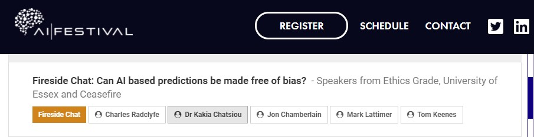

- **17 March 2021**: I am delivering a workshop as part of the COLGOV project to Civil Servants in Colombia on AI & civil protection ("Artificial intelligence for emergency response and civil protection: opportunities and application areas for Colombia"). Material are available [here](https://github.com/kakiac/AI4Disasters_ColGov).

- **24 February 2021**: I am speaking at the [BT AI Festival](https://aiglobalfestival.com/) on AI and ethics.

